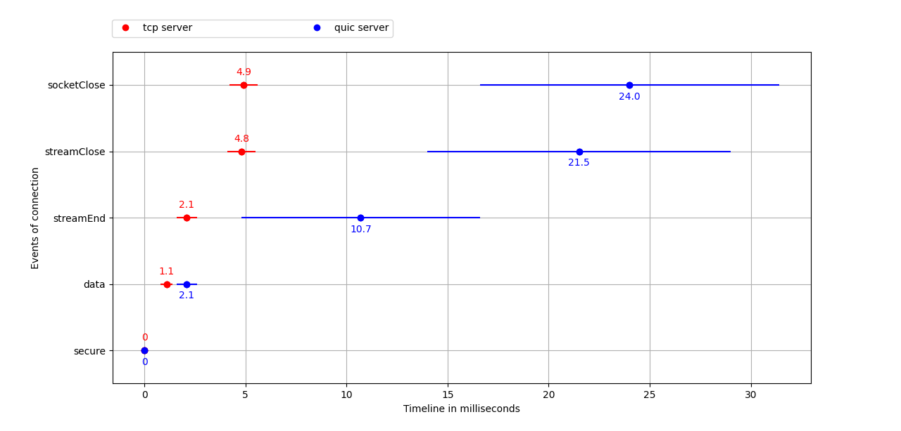

# University project QUIC benchmarking

A project comparing the performance of QUIC sockets with TCP sockets.

## Motivation

QUIC is a transport-layer protocol that was initially developed by Google and is currently developed and standardized by the IETF.
HTTP mapping with QUIC is called HTTP/3, the newest version of HTTP. Communication via QUIC is encrypted by default.  
The purpose of this project is performance measurement of the QUIC protocol and compare it with the transmission control protocol (TCP) in combination with the Transport Layer Security (TLS), because TCP does not communicate encrypted by default.

## Experiment setup

In the experiment, we implemented two different setups: Client-Server communication with QUIC and Client-Server communication with TCP+TLS.
We use the experimental nodejs version 15.0.6.
We decided to go with nodejs for this experiment because it is possible to set up QUIC as a socket and also directly as HTTP/3 and the documentation is really detailed.
Server and Client are currently running in a docker environment on one machine and communicate via localhost.

The [draft-27](https://tools.ietf.org/html/draft-ietf-quic-transport-27) on which the QUIC implementation of nodejs is based, expired on 24 August 2020. 
The current deployable draft is [draft-32](https://tools.ietf.org/html/draft-ietf-quic-transport-32).

The differences between those two drafts are mainly restructuring of the text, more detailed explanation of some features and the style of figures is different.
Also the behaviour in some special cases has changed, i.e. "A server that chooses a zero-length connection ID MUST NOT provide a preferred address."
Because we always use the same connection setup in which these special cases do not occur, they are not relevant for our project.
In conclusion, the expired [draft-27](https://tools.ietf.org/html/draft-ietf-quic-transport-27) implementation of QUIC in nodejs is still sufficiently up to date to be used for our QUIC evaluation.

The QUIC documentation to our nodejs experimental version is available here: https://nodejs.org/docs/v15.7.0/api/quic.html

:red_circle: The experimental nodejs version we used is **no longer maintained**, as explained in this [commit](https://github.com/nodejs/node/pull/37067
) in the official nodejs repository:
> The OpenSSL OMC has not yet committed to landing the updated QUIC APIs and has indicated that they will not even look at it until OpenSSL 3.1. With OpenSSL 3.0 > beta currently delayed with no clear idea of when it will actually land, the initial QUIC support landed in core has now just become a maintenance burden with 
> no clear idea of when we'd ever be capable of delivering it. This PR, therefore, removes the QUIC support and reverts the patched in modifications to openssl. I > will be investigating a userland alternative that does not depend on the built-in openssl bindings.

This happened unfortunately after we were nearly finished with our project. Switching to another QUIC Server/Client architecture and do everything again would not have been possible on such a short notice.
As we built our own dockerimage with the nodejs version installed, it is still easily possible to run our project without having to get the now deprecated nodejs version from some archived nodejs repository.

## Topology
For the measurements, we used a MacBook11,3 with macOS 11.02.1 as Server and a Thinkpad T480s with Ubuntu 20.04.2 LTS as Client.
Our Router only had the possibility to connect one LAN cable, because of this the Client had to be connected via WLAN. It is recommended to use LAN cable connections for both hosts if possible, because it reduces the network round trip time.


## Prerequisites

[dockerpy](https://docker-py.readthedocs.io/en/stable/):

```[bash]
pip3 install docker
```

[tshark](https://tshark.dev/setup/install/):

```[bash]
sudo apt-get install tshark
```

[matplotlib](https://matplotlib.org/stable/index.html):

```[bash]
pip3 install matplotlib
```

[colored](https://gitlab.com/dslackw/colored):

```[bash]
pip3 install colored
```

## Run setup

Commands required to benchmark the sockets on your machine.

### Run in docker container

To run the setup in docker you do not have to have nodejs installed. Instead the image, which is built from the [Dockerfile](Dockerfile) is pulled from [Dockerhub](https://hub.docker.com/r/ws2018sacc/experimentalnodejs).

#### Benchmark parameters


> Beware: If you wish to build the image using the Dockerfile, take note, that it takes a very long time (up to 30 min), because nodejs has to be rebuilt in experimental mode

The script generates a json file with timestamps for every comparable event for TCP+TLS and QUIC, as well as a packet capture via tshark and a json file documenting the ping output run simultaniously.

### Run locally on machine

> Beware: Running the server and client locally only works if you have nodejs 15.6 in experimental mode already installed on your system
> This is **not recommended**, use the docker setup instead.

```[bash]
npm run tcp
```

or

```[bash]
npm run quic
```

## Evaluation

### Flowchart TCP+TLS
The communication between TCP+TLS Server and TCP+TLS Client is depicted in the following flowchart:


### Flowchart QUIC
The communication between QUIC Server and QUIC Client is depicted in the followin QUIC flowchart:


The QUIC protocol uses two types of headers: Long Header for the handshake and Short Header after the connection is established.
In the QUIC flowchart, each packet of the handshake (depicted with <span style="color:#9673A6">purple</span> arrows) has a QUIC long header, after the connection is established, each packet has a QUIC short header.

The Long Header contains the following headerfields:
| Field Type | Size in Byte |
| --- | --- |
| Header Form | 1 |
| Fixed Bit | 1 |
| Packet Type | 1 |
| Reserved Bits | 1 |
| Packet Nr. field length | 1 |
| Version | 4 |
| DCID length | 1 |
| DCIC | 20 |
| SCID length | 1 |
| SCID | 20 |
| Token length | 1 |
| Length of Packet Nr. + payload fields | 2 |
| Packet Nr. | 1 |
| | Σ = 55 |

The Short Header contains the following headerfields:
| Field Type | Size in Byte |
| --- | --- |
| Header Form | 1 |
| Fixed Bit | 1 |
| Spin Bit | 1 |
| Reserved Bit | 1 |
| Key Phase Bit | 1 |
| Packet Nr. length | 1 |
| DCID | 20 |
| Packet Nr. | 1 |
| | Σ = 27 |

There is an important difference with the usage of TLS between QUIC and TCP, as noted in [draft-ietf-QUIC-tls-27](https://tools.ietf.org/html/draft-ietf-QUIC-tls-27#section-4):

> One important difference between TLS records (used with TCP) and QUIC
> CRYPTO frames is that in QUIC multiple frames may appear in the same
> QUIC packet as long as they are associated with the same encryption
> level.  For instance, an implementation might bundle a Handshake
> message and an ACK for some Handshake data into the same packet.

This can be seen at the QUIC flowchart:
The second packet (20,103 ms) contains one QUIC frame including TLS Server Hello, and another QUIC frame including TLS encrypted extensions. 
The fifth packet (92,746) contains one QUIC frame including TLS handshake finished, and another QUIC frame including a new connection ID. 

### Event comparisons


The events that occurred in the same sequence for QUIC and TCP, were picked to be compared by time difference.

### Time comparisons

Here is ..


If you look back to our package analysis, QUIC had fewer packets for the TLS Handshake than TCP. What is noticeable in this graph, is that even though the number of packets transferred is fewer for QUIC, the time duration is actually longer than for TCP.
We can think of two explanations for this result: firstly, the different priorities of executions in user-space and kernel-space. The QUIC protocol is implemented in user-space and the TCP protocol is implemented in kernel-space. User-space tasks have a lower priority in the execution sequence than kernel-space tasks. Secondly, the nodejs version 16.05 is an experimental build. The implementation for QUIC may not be 100% finished and we cannot be sure if this didn't affect our measurements.


