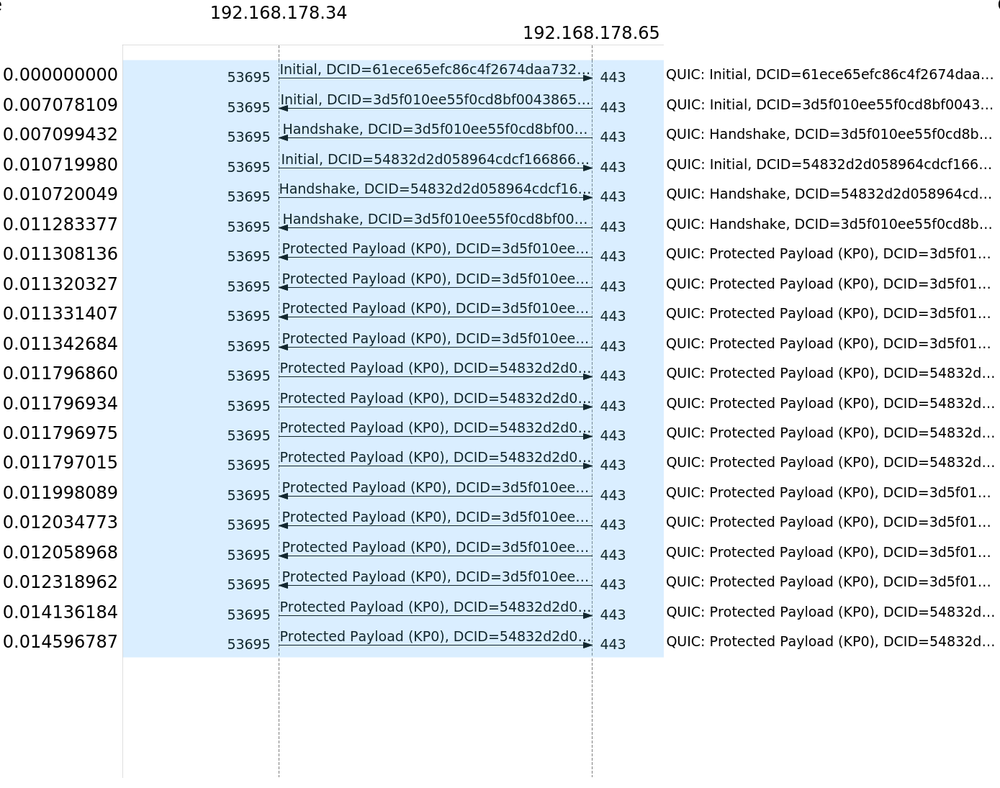

# University project QUIC benchmarking

Comparing the performance of the QUIC protocol with a combination of the TCP+TLS protocols on the transport layer via sockets.
- [University project QUIC benchmarking](#university-project-quic-benchmarking)
  - [Motivation](#motivation)
  - [Experiment setup](#experiment-setup)
    - [Hardware specifications](#hardware-specifications)
    - [Considerations regarding nodejs + QUIC](#considerations-regarding-nodejs--quic)
  - [Run setup](#run-setup)
    - [Run in docker container](#run-in-docker-container)
      - [Benchmark parameters](#benchmark-parameters)
    - [Run locally on machine](#run-locally-on-machine)
  - [Evaluation / Results](#evaluation--results)
    - [Event comparisons](#event-comparisons)
      - [QUIC events](#quic-events)
      - [TCP events](#tcp-events)
    - [Time comparison](#time-comparison)
      - [Adding Delay](#adding-delay)
      - [Delay: 10 ms](#delay-10-ms)
      - [Delay: 20 ms](#delay-20-ms)
      - [Delay: 50 ms](#delay-50-ms)
    - [Comparing nodejs to other implementations](#comparing-nodejs-to-other-implementations)
  - [Analysis](#analysis)
    - [Flowchart TCP+TLS](#flowchart-tcptls)
    - [Flowchart QUIC](#flowchart-quic)
    - [Comparison transmitted Bytes in summary](#comparison-transmitted-bytes-in-summary)
  - [Future Work](#future-work)

## Introduction

The purpose of this project is to analyze the behaviour and measure the performance of the QUIC protocol and compare it with the combination of the transmission control protocol (TCP) and the Transport Layer Security (TLS) protocol. 
QUIC is a transport-layer protocol that was initially developed by Google and is currently developed and standardized by the [IETF](https://datatracker.ietf.org/wg/quic/about/).
HTTP mapping with QUIC is standardized in the [HTTP/3-draft](https://tools.ietf.org/html/draft-ietf-quic-http-32), the newest version of HTTP. QUIC on the transport layer (what we will mainly analyze in this project) is standardized in the [quic-transport-layer-draft](https://tools.ietf.org/html/draft-ietf-quic-transport-32).
Communication via QUIC is encrypted by default. Because we compare it to TCP which is not encrypted by default, we always use TCP combined with TLS in our experiments for a fair comparison.
The main advantages of QUIC over TCP+TLS are:

* Multiplexed connections, allowing multiple streams of data to reach all the endpoints independently, and hence independent of packet losses involving other streams. 
  In contrast, HTTP/2 hosted on Transmission Control Protocol (TCP) can suffer head-of-line-blocking delays of all multiplexed streams if any of the TCP packets are delayed or lost. 
* QUIC uses encryption by default, while TCP needs to be used in combination with TLS to achieve encrypted communication. 
  This saves time and packets at the begin of each connection, because it is not necessary to first set up TCP and afterwards negotiate the encryption via TLS

First, we explain the general setup and the specific parameters (which OS was used, the topology of the network, etc.) of our experiment in the [Experiment setup](#experiment-setup) chapter. 
There is also a detailed explanation of a [problem](#considerations-regarding-nodejs+QUIC) we encountered during the project: The support for the nodejs-version we used run out because OpenSSL probably won't include QUIC-support until OpenSSL 3.1, which does not have an official release date yet.
In the chapter [Analysis](#analysis), we inspect the behaviour of each protocol in detail, mainly based on the pcap-files that are captured during the measurements. 
The behaviour is compared to the description in the QUIC-standard and the overhead for each protocol is calculated. 
The [Run setup](#run-setup)-section includes the prerequisites for recreating the experiments. 
In the [Evaluation / Results](#evaluation/results) chapter, we show the results of our measurements in detail. We used different methods to display the results of QUIC and TCP+TLS experiments with nodejs: Two figures show the specific events in comparison, and a third figure type shows intervals, i.e. the handshake duration with artifical network delay added.
Because our nodejs-results did not match the expectation that QUIC would outperform TCP+TLS at least when adding a huge amount of artificial network delay, we set up a [nginx server for comparison](#comparing-nodejs-to-nginx-/-another-QUIC-implementation) that also supports QUIC and TCP+TLS.
We measured nginx-QUIC and nginx-TCP+TLS each 10x with no artificial network delay added. Our results show that the nginx-QUIC-implemenation outperforms TCP+TLS for each measurement.
This affirms our hypothesis that TCP+TLS in nodejs outperfoms nodejs-QUIC because of the implementation, as it is still experimental and also recieves no support at the moment.

## Experiment setup

The basis for our setup is the experimental [nodejs version 15.0.6](https://nodejs.org/download/release/v15.6.0/).
We decided to go with nodejs for this experiment because it is possible to set up QUIC as a socket and also directly as HTTP/3. Moreover, the documentation is really detailed. 

In this experiment, we implemented two different Server-Client setups: One for communication via QUIC and the second for communication via TCP+TLS based on sockets. 
Both implementations were installed into docker containers and uploaded to [dockerhub](https://hub.docker.com/r/ws2018sacc/experimentalnodejs). Using docker has several advantages:

* For reproducing the measurements, it is not necessary to download+compile nodejs in experimental mode.
* The experiment can be easily used on different operation systems
* Conducting the measurements is automated via docker-compose

We conducted the experiments on two machines inside a local area network (LAN). It has the advantage that it comes closer to using the protocols in practice, as using TCP+TLS and QUIC only on localhost would give TCP an advantage because it runs in the kernel-space, not the user-space with lower priority like QUIC.
The specific parameters of the experiment (which OS was used etc.) of the experiment is described below.

### Hardware specifications

For conducting the measurements, we used a MacBook11,3 with macOS 11.02.1 as Server and a Thinkpad T480s with Ubuntu 20.04.2 LTS as Client, again running in docker-containers.  
Our Router only had the possibility to connect one LAN cable, because of this the Client had to be connected via WLAN. It is recommended to use LAN cable connections for both hosts if possible, because it reduces the network round trip time.


### Network conditions

For the comparison of each protocol, it is necessary to create the same network conditions during the testruns.
To achieve this goal, we monitored the network workload with constantly using [ping](https://linux.die.net/man/8/ping) and calculating the mean and standard deviation of the ping response for each measurement.
The ping statistics are saved in ping.json file and stored in the folder of the specific measurement. 
For example for the QUIC measurement ``2021-03-08 08-21-15.964770`` (== timestamp of the measurement) inside the folder ``samples_threshold5_dev2_delay0`` (read: underlying network threshold <= 5ms, standard deviation of ping <= 2ms, artificial network delay = 0ms) the ping-statistic is saved [here](./measurements/samples_threshold5_dev2_delay0/quic/remote/2021-03-08%2008-21-15.964770/ping.json).

The network-conditions for each measurement:
* **Underlying network RTT <= 5ms**: Measured with multiple pings and averaging the RTT-result of each ping.
* **Standard deviation of ping <= 2ms:** The standard deviation of the underlying network RTT measured with multiple pings.

### Considerations regarding nodejs + QUIC

The QUIC implementation of nodejs 15.0.6 is based on the QUIC IETF [draft-27](https://tools.ietf.org/html/draft-ietf-quic-transport-27).

The [draft-27](https://tools.ietf.org/html/draft-ietf-quic-transport-27) expired on 24 August 2020, the current deployable draft is [draft-32](https://tools.ietf.org/html/draft-ietf-quic-transport-32).
The differences between those two drafts are mainly restructuring of the text, more detailed explanation of some features and the style of figures is different.
Also the behaviour in some special cases has changed, i.e. "A server that chooses a zero-length connection ID MUST NOT provide a preferred address."
Because we always use the same connection setup in which these special cases do not occur, they are not relevant for our project.
In conclusion, the expired [draft-27](https://tools.ietf.org/html/draft-ietf-quic-transport-27) implementation of QUIC in nodejs is still sufficiently up to date to be used for our QUIC evaluation.

The QUIC documentation to our nodejs experimental version is available [here](https://nodejs.org/docs/v15.6.0/api/quic.html).

:red_circle: The experimental nodejs version we used is **no longer maintained**, as explained in this [commit](https://github.com/nodejs/node/pull/37067) in the official nodejs repository:
> The OpenSSL OMC has not yet committed to landing the updated QUIC APIs and has indicated that they will not even look at it until OpenSSL 3.1. With OpenSSL 3.0 > beta currently delayed with no clear idea of when it will actually land, the initial QUIC support landed in core has now just become a maintenance burden with
> no clear idea of when we'd ever be capable of delivering it. This PR, therefore, removes the QUIC support and reverts the patched in modifications to openssl. I > will be investigating a userland alternative that does not depend on the built-in openssl bindings.

This happened unfortunately after we were nearly finished with our project. Switching to another QUIC Server/Client architecture and do everything again would not have been possible on such a short notice.
As we built our own dockerimage with the nodejs version installed, it is still easily possible to run our project without having to get the now deprecated nodejs version from some archived nodejs repository.


## Analysis

The general structure of QUIC and TCP+TLS communication, based on network protocol layers:


Both protocols work similar until they use TCP and UDP respectively in the transport layer.
Notably, the payload of the transport layer protocols is structured different: 
* **TCP+TLS**: The TLS layer is directly included in the TCP payload. Traffic control is managed by TCP.
* **QUIC:** The QUIC packet is included in the UDP payload. The encryption is also done via TLS, but the TLS CRYPTO frames are part of the QUIC payload. Traffic control is managed by QUIC. After exchanging encryption details via TLS, QUIC communication works with encrypted streams.

This section is mainly based on the analysis of the packages captured on the network interface of the client during the testruns.
The traffic on the interface is captured with [tshark](https://tshark.dev). The resulting [pcapng](https://wiki.wireshark.org/Development/PcapNg#PcapNg) (short for packet capture next generation dump file format ) files are the basis for analyzing the behaviour of the different protocols in detail.

All pcap-files can be viewed in [wireshark](https://www.wireshark.org/) for comparison, it is the GUI version of tshark.
To be able to decrypt the pcap files, it is necessary to add the corresponding SSL-keys to wireshark:
The SSL-keys for each pcap-file can be found in the subfolder for each measurement.
For example the SSL-key for [this QUIC pcap-file](./measurements/samples_threshold5_dev2_delay0/quic/remote/2021-03-08%2008-21-15.964770/quic.pcap) is located in the same folder [here](./measurements/samples_threshold5_dev2_delay0/quic/remote/2021-03-08%2008-21-15.964770/ssl-keys.log).
After opening a specific pcap-file in wireshark, go to Edit&#8594;Preferences&#8594;Protocols&#8594;TLS and add the path to the **corresponding** SSL-key.log to field "(Pre)-Master-Secret log filename".

Based on these pcap-files, we generate flowcharts and compare the overhead for the transmitted payload where we depict the properties of each protocol.
This is done only for the measurements of QUIC and TCP+TLS with **no artificial threshold added** to the network RTT, because the goal is to analyze the protocol behaviour in general.
The flowcharts are described in detail in the following sections:

### Flowchart TCP+TLS

First, the relative timestamps of each TCP+TLS pcap file (with **no artificial network RTT** added) are extracted:

> tshark -r tcp.pcap -T fields -e frame.time_relative > timestamps.csv

Notably, from all 10 captured tcp-pcap files, there exist 2 pcaps that contain 1 packet less than the other 8 pcaps. These 2 pcaps contain 13 packets, while the remaining 8 pcaps contain 14 packages:

| Measurement Timestamp of pcap | # packets transmitted |
| --- | --- |
| 2021-03-08 08-53-34.612692 | 14 |
| 2021-03-08 08-55-12.544361 | **13** |
| 2021-03-08 08-56-46.086451 | 14 |
| 2021-03-08 08-58-29.177156 | 14 |
| 2021-03-08 08-59-06.053982 | 14 |
| 2021-03-08 09-00-39.234748 | 14 |
| 2021-03-08 09-06-13.770530 | 14 |
| 2021-03-08 09-08-23.246872 | **13** |
| 2021-03-08 09-08-55.386537 | 14 |
| 2021-03-08 09-12-51.075999 | 14 |

This is due to a missing __TCP Window update__ package in the 8 tcp-pcap files. This doesn't change important behaviour of the protocol (i.e. the handshake) in general. 
Therefore, to create a consistent flowchart and calculate the average value of each sent packet, the 2 tcp-pcap files which contain 13 packets are omitted.

The script [process_pcaps_tcp+tls.py](.measurements/process_pcaps_tcp+tls.py) uses the timestamps.csv of each tcp-pcap and filters out the ones where 13 packets instead of 14 are transmitted.
Then, the average of the timestamps of each connection is printed - these mean values are used as timestamps in the following flowchart.
Moreover, important properties of each packet (i.e. the flags like ACK, FIN or the handshake messages) and the Bytes of the packet on wire are shown. 


The TCP protocol contains the following headerfields:
| Field Type | Size in Byte |
| --- | --- |
| Source Port | 2 |
| Destination Port | 2 |
| Sequence number | 4 |
| Acknowledgement number | 4 |
| Flags | 2 |
| Window size | 2 |
| TCP checksum | 2 |
| Urgent pointer | 2 |
| Options | 12 |
| |  Σ = 32 |

### Flowchart QUIC

Like for the TCP+TLS flowcharts, the relative timestamps of each quic-pcap file (with **no artificial network RTT** added) are extracted:

> tshark -r quic.pcap -T fields -e frame.time_relative > timestamps.csv

Notably, for the quic-pcap files, only 5 out of 10 measurements contain the same amount of packages sent: During 5 measurements 10 packets were sent, during the other 5 measurements 11 packets were sent.
For each connection with 11 packets, there is one more ACK-packet sent at the end:

| Measurement Timestamp of pcap | # packets transmitted |
| --- | --- |
| 2021-03-08 08-21-15.964770 | 10 |
| 2021-03-08 08-23-34.178260 | 11 |
| 2021-03-08 08-25-08.967745 | 10 |
| 2021-03-08 08-26-31.705285 | 10 |
| 2021-03-08 08-28-21.012236 | 11 |
| 2021-03-08 08-32-17.040706 | 11 |
| 2021-03-08 08-34-36.318718 | 10 |
| 2021-03-08 08-40-19.121335 | 11 |
| 2021-03-08 08-42-11.102905 | 11 |
| 2021-03-08 08-43-43.584919 | 10 |

The missing ACK-package doesn't seem to have an impact on the protocol behaviour.
So we decided for the flowcharts to work only with the pcap-files with **10 tansmitted packets** to generate a consistent flowchart where we can calculate the average over each packet timestamp:

The script [process_pcaps_quic.py](.measurements/process_pcaps_quic.py) uses the timestamps.csv of each quic-pcap and filters out the ones with 11 packets transmitted.
Then, the mean values of the timestamp of each connection is printed - these mean values are used as timestamps in the following flowchart.
Moreover, important properties of each packet (i.e. the flags like ACK, FIN or the handshake messages) and the Bytes of the packet on wire are shown. 


QUIC frames are encapsulated in the payload of UDP packets.
The UDP protocol contains the following headerfields:
| Field Type | Size in Byte |
| --- | --- |
| Source port | 2 |
| Destination port | 2 |
| Length | 2 |
| Checksum | 2 |
| | Σ = 8 |

The QUIC protocol uses two types of headers: Long Header for the handshake and Short Header after the connection is established.
In the QUIC flowchart, each packet of the handshake (depicted with <span style="color:#9673A6">purple</span> arrows) has a QUIC long header, after the connection is established, each packet has a QUIC short header.

The Long Header contains the following headerfields:
| Field Type | Size in Byte |
| --- | --- |
| Header Form | 1 |
| Fixed Bit | 1 |
| Packet Type | 1 |
| Reserved Bits | 1 |
| Packet Nr. field length | 1 |
| Version | 4 |
| DCID length | 1 |
| DCIC | 20 |
| SCID length | 1 |
| SCID | 20 |
| Token length | 1 |
| Length of Packet Nr. + payload fields | 2 |
| Packet Nr. | 1 |
| | Σ = 55 |

The Short Header contains the following headerfields:
| Field Type | Size in Byte |
| --- | --- |
| Header Form | 1 |
| Fixed Bit | 1 |
| Spin Bit | 1 |
| Reserved Bit | 1 |
| Key Phase Bit | 1 |
| Packet Nr. length | 1 |
| DCID | 20 |
| Packet Nr. | 1 |
| | Σ = 27 |

There is an important difference with the usage of TLS between QUIC and TCP, as noted in [draft-ietf-QUIC-tls-27](https://tools.ietf.org/html/draft-ietf-QUIC-tls-27#section-4):

> One important difference between TLS records (used with TCP) and QUIC
> CRYPTO frames is that in QUIC multiple frames may appear in the same
> QUIC packet as long as they are associated with the same encryption
> level.  For instance, an implementation might bundle a Handshake
> message and an ACK for some Handshake data into the same packet.

This can be seen at the QUIC flowchart:
The second packet (20,103 ms) contains one QUIC frame including TLS Server Hello, and another QUIC frame including TLS encrypted extensions.
The fifth packet (92,746 ms) contains one QUIC frame including TLS handshake finished, and another QUIC frame including a new connection ID.

### Comparison transmitted Bytes in summary

The information of the given flowcharts + documentiation summarized:

| | TCP+TLS | QUIC |
| ------------ | ------------ | ------------- |
| **headerbytes/packet** | 32 (TCP) | 8 (UDP) + 55 (QUIC long header) = 63 |
| | 32 (TCP) | 8 (UDP) + 27 (QUIC short header) = 35 |
| **Σ Handshake on wire** | 2068 | 2947 |
| **Σ Bytes transmitted in total** | 2589 | 4141 |
| **Established connection** | 2589 (Bytes in total) - 2068 (Handshake) = 521 | 4141 (Bytes in total) - (2947 (Handshake) + 78 (1.QUIC frame) - 110 (2.QUIC frame)) = 1162 |
| **Encrypted Application data** | 207 | 126 |
| **Raw Application data** | 46 | 46 |
| **Overhead** (Σ Bytes transmitted in total) - (Raw Application data) | 2589 - 46 = 2543 | 4141 - 46 = 4095 |

In conclusion, QUIC is transmitting more data than TCP+TLS for transmitting the same application data - QUIC uses roughly 2x the overhead of TCP+TLS to transmit the 46 Byte mesage "I am the client sending you a message" from client to server.
QUIC uses roughly 1/3 more data than TCP+TLS during the handshake. This difference is not because the long header is used: The padding in the first packet/Client initial that is embedded after the "TLS Client hello" has a size of **921 Bytes**, consisting of zeros. This is necessary due to technical and security reasons:

IETF documentation: [Padding](https://tools.ietf.org/html/draft-ietf-quic-transport-27#page-111) states:
> The PADDING frame (type=0x00) has no semantic value.  PADDING frames
> can be used to increase the size of a packet.  Padding can be used to
> increase an initial client packet to the minimum required size, or to
> provide protection against traffic analysis for protected packets.

IETF documentation: [Packet Size](https://tools.ietf.org/html/draft-ietf-quic-transport-27#section-14)) states:

> **A client MUST expand the payload of all UDP datagrams carrying
> Initial packets to at least 1200 bytes** by adding PADDING frames to
> the Initial packet or by coalescing the Initial packet.
> Sending a UDP datagram of this size ensures that the
> network path from the client to the server supports a reasonable
> Maximum Transmission Unit (MTU).  Padding datagrams also helps reduce
> the amplitude of amplification attacks caused by server responses
> toward an unverified client address.

After establishing the connection, the QUIC headersize is similar to the TCP headersize. Still, QUIC uses ~2x the amount of data than TCP+TLS.

In summary, QUIC is transmitting more data, but is sending fewer packets than TCP. It is unfortunate that QUIC needs 921 Bytes in the handshake only for padding, but it is necessary due to technical and security reasons. Maybe it is possible to improve the QUIC protocol by filling the first packet more efficiently.
Reusing the same connection to send more application data would at least reduce the handshake data for QUIC and probably improve the performance - this is also stated in [Future Work](#future-work).
QUIC takes ~2x the time of TCP+TLS to transfer the application data, although it is sending 2 packets less. This could be because QUIC is running in user-space instead of kernel-space, like TCP+TLS (see the summary of [Time Comparison](#time-comparison) for a detailed explanation).
Moreover, the QUIC implementation in the nodejs version we are using is still experimental, so this could also be a limiting factor.

## Run setup

In this chapter, the prerequisites and commands for reproducing our experiments are described.
The following software needs to be installed:

```[bash]
pip3 install docker
sudo apt-get install tshark
pip3 install matplotlib
pip3 install colored
```

The following commands are required to start benchmarking on your machine.

### Run in docker container

To run the setup in docker nodejs does not have to be installed. It is sufficient to use our docker-image, which is built from the [Dockerfile](Dockerfile) and is pulled from [Dockerhub](https://hub.docker.com/r/ws2018sacc/experimentalnodejs).

#### Benchmark parameters


> Beware: If you wish to build the image using the Dockerfile, take note, that it takes a very long time (up to 30 min), because nodejs has to be rebuilt in experimental mode

The script generates a json file with timestamps for every comparable event for TCP+TLS and QUIC, as well as a packet capture via tshark and a json file documenting the ping output run simultaniously.

### Run locally on machine

> Beware: Running the server and client directly on your OS only works if you have nodejs 15.0.6 in experimental mode already installed on your system
> This is **not recommended**, use the docker setup instead.

```[bash]
npm run tcp
```

or

```[bash]
npm run quic
```

## Evaluation / Results

In this chapter, the results of the experiments are interpreted and represented in different forms.

The results are saved in the following directory structure:

```bash
measurements
├── samples_threshold15_dev2_delay10
│   ├── quic
│   │   └── remote
│   │       ├── 2021-03-11 00-31-37.626624
│   │       │   ├── ping.json
│   │       │   ├── quic-benchmark-client.json
│   │       │   ├── quic-benchmark-server.json
│   │       │   ├── quic.pcap
│   │       │   └── ssl-keys.log
│   │       └── ...
│   └── tcp
│       └── remote
│           ├── 2021-03-11 00-54-54.330962
│           │   ├── ping.json
│           │   ├── ssl-keys.log
│           │   ├── tcp-benchmark-client.json
│           │   ├── tcp-benchmark-server.json
│           │   └── tcp.pcap
│           └── ...
├── samples_threshold25_dev2_delay20
│   ├── quic
│   │   └── ...
│   └── tcp
│       └── ...
└── ...
```

As it can be seen at the folder structure above, after conducting the measurements, the following files have been generated for each QUIC and TCP+TLS measurement:

* **ping.json:** For reporting the current workload of the network during measuring, the round trip time of the network is measured by running the [ping-command](https://linux.die.net/man/8/ping) in parallel.
* **ssl-keys.log:** The ssl-key that is needed to decrypt the corresponding pcap-file in the same folder.
* **tcp/quic-benchmark-client.json:** The events of the client and their corresponding timestamps.
* **tcp/quic-benchmark-server.json:** The events of the server and their corresponding timestamps.
* **tcp/quic.pcap:** The pcap-file that is generated during the measurement by capturing on the network-interface of the client with tshark.

### Event comparisons

This section analyzes the behaviour and results of the QUIC and TCP+TLS protocol on the basis of the events of nodejs.
We chose multiple comparable events for [QUIC](https://nodejs.org/docs/v15.6.0/api/quic.html) and [TCP](https://nodejs.org/docs/v15.6.0/api/net.html) and [TLS](https://nodejs.org/docs/v15.6.0/api/tls.html), that are emitted during the stages of connection and transmission.
Notably, **not** all events are happening **at the same point** during QUIC / TCP+TLS protocol execution, even though some have the same name.
All events that are happening at the same point in the protocol execution and can therefore be used for comparison are marked with a &#10003;-symbol, the non-comparable ones with a &#10007;-symbol.

|   Label                 |  QUIC event                   |   TCP event  | Event comparable? |
| :-------------          | :----------                   | :----------- | :-----------  |
|   listening             |  QuicSocket.listening         | net.Server.listening| &#10007;|
|   ready                 |  QuicSocket.ready             | net.Socket.ready | &#10007;|
|   session               |  QuicSocket.session           | tls.Server.newSession | &#10007;|
|   keylog                |  QuicSession.keylog           | tls.Server.keylog | &#10007;|
|   secure                |  QuicSession.secure           | tls.Server.secureConnection | &#10003;|
|   data                  |  QuicStream.data              | net.Socket.data | &#10003;|
|   streamEnd             |  QuicStream.end               | net.Socket.end | &#10003;|
|   streamClose           |  QuicStream.close             | net.Socket.close | &#10003;|
|   socketClose           |  QuicSocket.close             | net.Server.close | &#10003;|
|   error                 |  QuicSocket.error             | net.Socket.error | &#10007;|
|   handshakeDurationInNs | QuicSession.handshakeDuration | tls.Server.connection - tls.Server.secureConnection | &#10003; |

This following graph gives an overview of the timeline of **all** events for each protocol:


#### QUIC events

* QuicSocket.**listening:** Quic Server Socket is listening for new connections
* QuicSocket.**ready:** Client Quic Socket has been bound to an UDP Port
* QuicSocket.**session:** Quic Server Session has been created
* QuicSession.**keylog:** Key material is generated or received by a QuicSession. Can be during or immediately following the handshake process
* QuicSession.**secure:** Quic Session declares TLS Handshake has been completed
* QuicStream.**data:** Quic Stream receives data
* QuicStream.**end:** Quic Stream has ended, all data received
* QuicStream.**close:** Quic Stream is completely closed and the underlying resources have been freed
* QuicSocket.**close:** Quic Socket has been destroyed and is no longer usable
* QuicSocket.**error:** Quic Socket was destroyed with an error
* QuicSession.**handshakeDuration:** length of time taken to complete the TLS handshake

#### TCP events

* net.Server.**listening:** Server has been bound after calling server.listen()
* net.Socket.**ready:** Client Socket is ready to be used. Triggered immediately after net.Socket.connect
* tls.Server.**newSession:** Emitted upon creation of a new TLS session
* tls.Server.**keylog:** Key material is generated or received by a connection to this server (typically before handshake has completed, but not necessarily)
* tls.Server.**secureConnection:** Handshaking process for a new connection has successfully completed
* net.Socket.**data:** Emitted when data is received
* net.Socket.**end:** Emitted when the other end of the socket sends a FIN packet, thus ending the readable side of the socket
* net.Socket**close:** socket is fully closed
* net.Server.**close:** Server closes. If connections exist, this event is not emitted until all connections are ended
* net.Socket.**error:** Error occurs. The 'close' event will be called directly following this event
* tls.Server.**connection** Emitted when a new TCP stream is established, before the TLS handshake begins

We sent the application data "I am the client sending you a message" 10x with the QUIC and TCP+TLS implementation respectively.
The following graph shows the average value of the 5 **comparable events** (also marked in the events-table) "secure, data, streamEnd, streamClose, socketClose":


### Time comparison

For further comparison, we defined specific durations for the communication using the events mentioned before.

* **Handshake**: handshakeDuration
* **Time to first Byte**: secure -> data
* **Content Transfer**: data -> streamEnd
* **Close socket**: streamEnd -> socketClose

We sent the application data "I am the client sending you a message" 10x with the QUIC and TCP+TLS implementation with no artificial delay added, and calculated the average value:


| Protocol: QUIC | Handshake | Time to first Byte | Content transfer | Close socket |
| ------------- | ---------- | ----------- | ----------- | ----------- |
| Average value / mean (ms) | 20.6 | 2.1 | 8.6 | 13.3 |
| Standard deviation (ms) | 9.1 | 0.5 | 6.2 | 5.1 |

| Protocol: TCP+TLS | Handshake | Time to first Byte | Content transfer | Close socket |
| ------------- | ---------- | ----------- | ----------- | ----------- |
| Average value / mean (ms) | 10.0 | 1.1 | 1.1 | 2.8 |
| Standard deviation (ms) | 2.7 | 0.3 | 0.3 | 0.4 |

If looking back at the package analysis, QUIC uses fewer packets for the TLS Handshake than TCP. What is noticeable in this graph, is that even though the number of transferred packets is fewer for QUIC, the total duration of the connection is actually longer compared to TCP.
We can think of two explanations for this result: 
Firstly, the different priorities when executing a network protocol in user-space and kernel-space. The QUIC protocol is implemented in user-space and the TCP protocol is implemented in kernel-space. User-space tasks have a lower priority in the execution sequence than kernel-space tasks. 
Secondly, the nodejs version 16.05 is an experimental build. The implementation for QUIC may not be 100% finished and we cannot be sure if this didn't affect our measurements.

Beside the **Handshake**, the remaining durations **Time to first Byte**, **Content Transfer** and  **Close socket** are lower with TCP/TLS than with QUIC. We also contribute this to the TCP kernel implementation.

#### Adding Delay

To see how the content transfer is affected by a slower connection, we added various network delays using [traffic control (TC)](https://linux.die.net/man/8/tc).
We sent the application data "I am the client sending you a message" 10 times and calculated the average value.
This is an overview of the results of all the results and the respective delays we used in summary:


With increased delay, we can see a linear increase for the duration of **Handshake**, **Time to first Byte** and **Content Transfer** for both TCP/TLS and QUIC.
QUIC has a steeper linear increase than TCP.
Most noticeable and surprising is the spike in the duration of **Close socket** for QUIC. We assume this is caused by the specific QUIC implementation in nodejs, as it is still in experimental state.

#### Delay: 10 ms

We sent the application data 10 times with the QUIC and TCP+TLS implementation respectively and added a round trip time (RTT) delay of 10ms on top of the existing network RTT. The following graph shows the average values:


| Protocol: QUIC | Handshake | Time to first Byte | Content transfer | Close socket |
| ------------- | ---------- | ----------- | ----------- | ----------- |
| Average value / mean (ms) | 33.6 | 2.9 | 18.5 | 524.2 |
| Standard deviation (ms) | 11.4 | 0.7 | 1.8 | 473.3 |

| Protocol: TCP+TLS | Handshake | Time to first Byte | Content transfer | Close socket |
| ------------- | ---------- | ----------- | ----------- | ----------- |
| Average value / mean (ms) | 22.0 | 1.4 | 1.6 | 3.9 |
| Standard deviation (ms) | 2.4 | 0.7 | 0.7 | 0.5 |

#### Delay: 20 ms

We sent the application data 10 times with the QUIC and TCP+TLS implementation respectively and added a round trip time (RTT) delay of 20ms on top of the existing network RTT. The following graph shows the average values:


| Protocol: QUIC | Handshake | Time to first Byte | Content transfer | Close socket |
| ------------- | ---------- | ----------- | ----------- | ----------- |
| Average value / mean value (ms) | 41.3 | 4.4 | 28.9 | 595.9 |
| Standard deviation (ms) | 2.8 | 0.5 | 1.3 | 471.6 |

| Protocol: TCP+TLS | Handshake | Time to first Byte | Content transfer | Close socket |
| ------------- | ---------- | ----------- | ----------- | ----------- |
| Average value / mean value (ms) | 35.3 | 2.2 | 2.1 | 5.4 |
| Standard deviation (ms) | 2.8 | 0.4 | 0.3 | 0.5 |

#### Delay: 50 ms

We sent the application data 10 times with the QUIC and TCP+TLS implementation respectively and added a round trip time (RTT) delay of 50ms on top of the existing network RTT. The following graph shows the average values:


| Protocol: QUIC | Handshake | Time to first Byte | Content transfer | Close socket |
| ------------- | ---------- | ----------- | ----------- | ----------- |
| Average value / mean value | 73.7 | 4.9 | 60.3 | 216.2 |
| Standard deviation | 2.1 | 0.3 | 2.1 | 383.2 |

| Protocol: TCP+TLS | Handshake | Time to first Byte | Content transfer | Close socket |
| ------------- | ---------- | ----------- | ----------- | ----------- |
| Average value / mean value | 65.7 | 2.2 | 2.3 | 5.2 |
| Standard deviation | 4.7 | 0.4 | 0.5 | 0.3 |

### Comparing nodejs to nginx / another QUIC implementation

With QUIC taking a significant amount of time longer for Handshake, Content Transfer and most noticeable Close socket, we hypothesized that this may be due to the experimental implementation of QUIC in nodejs. To test this hypothesis, we compared it to the QUIC implementation for nginx.
Following the guide [here](https://faun.pub/implementing-http3-quic-nginx-99094d3e39f), we used the Docker images:

- [ymuski/nginx-quic](https://hub.docker.com/r/ymuski/nginx-quic) for the server capable of HTTP/3 and HTTP/2
- [ymuski/curl-http3](https://hub.docker.com/r/ymuski/curl-http3) for the client capable of HTTP/3 curl GET request
- [curlimages/curl](https://hub.docker.com/r/curlimages/curl) for the client capable of HTTP/2 curl GET request

Similarly to nodejs, we captured the traffic using tshark in the same network. We also pinged the server, to ensure RTT avg was less than 5ms and stdev less than 2ms.
  
| NGINX HTTP/3 QUIC | NGINX HTTP/2 TCP |
| :---------------- | :--------------- |
|  |  |

Looking at the traffic flow, the complete communication for HTTP/3 took 17ms less than HTTP/2.

| NGINX HTTP/3 QUIC | Nodejs QUIC Socket |
| :---------------- | :----------------- |
|  |  |

Here in comparison is the nginx HTTP/3 implementation and the nodejs socket implementation.
We can see that even though the nodejs communication does not include the application layer, it is still overall taking 24ms longer to complete.
This supports our hypothesis that the implementation of nodejs for QUIC in its experimental state is not yet applicable and returns worse results than TCP/TLS.


## Future Work

Based on the results we obtained in our experiment and the features we managed to implement in the given time, we think it would be interesting to explore the following topics:

* **Simulation of packet loss with the [TC tool](https://linux.die.net/man/8/tc):** One of the main advantages of QUIC is the improved package loss handling. Therefore it is possible that increasing the packet loss during measurements leads to better results for QUIC.

* **Reusing the connection for sending more payload:** As the socket close event of the QUIC connection takes exceedingly more time than all other events and the QUIC handshake is transmitting a lot of data, reusing the connection will probably improve QUIC performance.

* **Comparison of socket-based transport layer with HTTP/3 application layer:** It could be interesting to check the difference in performance when comparing socket layer implementation to application layer implementation.

* **Comparison of TCP+TLS and QUIC with QUIC executed in kernel-space:** We think that the biggest disadvantage of QUIC in comparison to TCP+TLS is its execution in the user-space, because of the lower priority. If both are compared while executed in kernel-space, QUIC might perform better.
