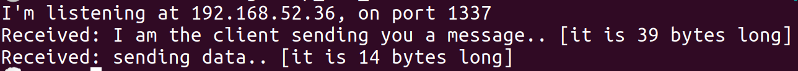

# In this folder, we have a setup for a server-client pair, implemented in nodejs, which communicates either through a QUIC socket or a TCP socket with TLS

Prerequisites: [dockerpy](https://docker-py.readthedocs.io/en/stable/). It can be installed with:

```
pip3 install docker
```

To run he setup, execute the run_server_client.py file.
the setup file takes one parameter, that determines which kind of server-client-scenario is setup.

```
python3 run_server_client.py quic
python3 run_server_client.py tcptls
```

> Warning: building the image takes a very long time (up to 20 min), because nodejs has to be rebuild in experimental mode

If you execute `sudo docker logs {container_name}` after setup, you will see output that looks like this:
